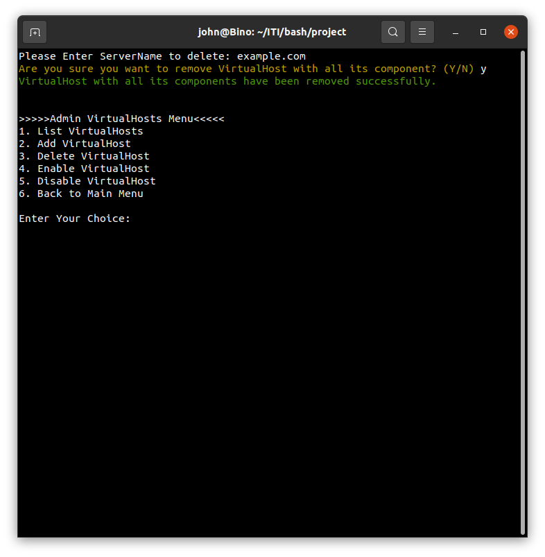

# Apache Admin V 1.0.0 
╔═══╗────────╔╗─────╔═══╗─╔╗
║╔═╗║────────║║─────║╔═╗║─║║
║║─║╠══╦══╦══╣╚═╦══╗║║─║╠═╝╠╗╔╦╦═╗
║╚═╝║╔╗║╔╗║╔═╣╔╗║║═╣║╚═╝║╔╗║╚╝╠╣╔╗╗
║╔═╗║╚╝║╔╗║╚═╣║║║║═╣║╔═╗║╚╝║║║║║║║║
╚╝─╚╣╔═╩╝╚╩══╩╝╚╩══╝╚╝─╚╩══╩╩╩╩╩╝╚╝
────║║
────╚╝
─────╔╗─╔═══╗╔═══╗
────╔╝║─║╔═╗║║╔═╗║
╔╗╔╗╚╗║─║║║║║║║║║║
║╚╝║─║║─║║║║║║║║║║
╚╗╔╝╔╝╚╦╣╚═╝╠╣╚═╝║
─╚╝─╚══╩╩═══╩╩═══╝
╔══╗───────╔╗──╔╗─────╔═══╗
║╔╗║───────║║──║║─────║╔═╗║
║╚╝╚╦╗─╔╗──║╠══╣╚═╦═╗─║║─╚╬══╦══╦═╦══╦══╗
║╔═╗║║─║║╔╗║║╔╗║╔╗║╔╗╗║║╔═╣║═╣╔╗║╔╣╔╗║║═╣
║╚═╝║╚═╝║║╚╝║╚╝║║║║║║║║╚╩═║║═╣╚╝║║║╚╝║║═╣
╚═══╩═╗╔╝╚══╩══╩╝╚╩╝╚╝╚═══╩══╩══╩╝╚═╗╠══╝
────╔═╝║──────────────────────────╔═╝║
────╚══╝──────────────────────────╚══╝

## What is Apache Admin
Apache admin is an opensource bash script to control your Apache Web-Server fully, installing/uninstalling Apache web-server, edit your Apache configurations with just small number of tabs for choosing and much more as shown in documentation.

## Installing Apache Admin

 - First you have to clone the Apache from the GitHub repository `git clone https://github.com/bin0mial/apache-admin.git` 
 - Next start using Apache make the file executable by using the following command 
`chmod +x apache-admin/main.sh` 
then run it as follows: `sudo ./apache-admin/main.sh`
Or
You can run it directly using the following code: `sudo bash ./apache-admin/main.sh`

- In case you don't run as a `root`

- After Successful running the following screen show

## Go farther with Apache Admin
As shown after successful installation page you will get the following choices:

 1. Toggle Hosting type (Default Enabled)
 2. Install/Remove Apache Web Server
 3. Administrate Virtual-host
 4. Configure Authentication
 5. Quit
___
### Toggle Hosting type
This choice only to toggle whether it will be hosted locally or on a server its default value is `enabled`. In case of hosting locally enabled virtual hosts will be directly added to `/etc/hosts` file as follows:

> 127.0.0.1	john.com
> 127.0.0.1	www.john.com
___
### Install/Remove Apache Web Server
This option is very **dangerous** because it can delete your Web Server if it is installed, but don't worry we will take your confirmation in case of installation or removal
 
 ___
### Administrate Virtual-host
 It's one of our most cool feature, this feature can 
 1. List Virtual-Hosts
	 - We care about your view to Apache virtual hosts available so we ignored `apache2ctl -S` and created our special view for you.
	 
 2. Add Virtual-Host
	 - You can add new Virtual host by as simple as possible by just entering your `Server Name` and your `Email` << Optional >>.
	 - Try to make sure that your `Server Name` is unique or you will get an error.
	 - If it is created successfully you will get the following response:
	   
 3. Delete Virtual-Host
	 - It is very simple here to delete a virtual host all you have to do is typing the `Server Name` and vola it is deleted if it is exists.
	 - The response if it is successful will be as follows:
	 
 4. Enable Virtual-Host
	 - Unfortunately web server can't run on its own after installation, you must enable the virtual host by using this option and type the virtual host `Server Name` and leave the script prepare everything for you.
	 - If everything goes alright you should receive the following response:
	 
 ---Note don't forget about the toggle host, because hosts file will be affected in this part.
	
 5. Disable Virtual-Host
	- It is that simple as Enabling Virtual-Host, all you have to do is to type `Server Name` and vola, you deactivated the targeted virtual host with out losing any data, also you can enable it anytime.
	- If it is successfully exists and disabled you will see this output:
	
	---Note don't forget about the toggle host, because hosts file will be affected in this part.
 6. Back to Main Menu
___
### Configure Authentication
Now its security time, Apache Admin deals with security you can authorize who can access your virtual host and who can't simply Apache Admin provide you is various options to do that:
 1. Enable Authentication
	 - By default authentication is not enabled in virtual host, you can enable it by just send the `Server Name` and if it is the first time, you should send us Admin `username` and `password`, if all data is provided correctly you should get this screen:
	  
 2. Disable Authentication
	- No longer need authentication simply you can disable it by just providing us with `Server Name` and keep the rest from validation and so on on  us
	- Successful response will be provided to you as follows:
	
 3. List Authenticated Users
	 - In this part you can list users who have authentication in the virtual host and can access it, simply send Server Name and it will be listed as follows if file and people exists:
	 
 4. Add Authentication User
	- Now after enabling authentication, of course you need some users to login on your system, you can choose this option and provide us with `Server Name`, `username` and `password` to be added immediately. 
	- Successful response will reach to you as follows:
	
 5. Remove Authentication User
	- Now if you no longer need user, just remove him from the server, and it is that simple, just provide us with Server Name, and username only, and leave the deleting on us.
	- If removed successfully you will receive the following response
		
 6. Back to Main Menu
___
**That's all for Apache Admin**

╔══╦╗──────╔╗─╔═╦╗────╔══╗───╔╦╦═╦╗
╚╗╔╣╚╦═╗╔═╦╣╠╗╚╗║╠═╦╦╗║═╦╩╦╦╗║║║═╬╬═╦╦═╗
─║║║║║╬╚╣║║║═╣╔╩╗║╬║║║║╔╣╬║╔╝║║╠═║║║║║╬║
─╚╝╚╩╩══╩╩═╩╩╝╚══╩═╩═╝╚╝╚═╩╝─╚═╩═╩╩╩═╬╗║
─────────────────────────────────────╚═╝
╔══╗──────╔╗───╔══╗╔╗──╔╗
║╔╗╠═╦═╗╔═╣╚╦═╗║╔╗╠╝╠══╬╬═╦╗
║╠╣║╬║╬╚╣═╣║║╩╣║╠╣║╬║║║║║║║║
╚╝╚╣╔╩══╩═╩╩╩═╝╚╝╚╩═╩╩╩╩╩╩═╝
───╚╝
╔══╗───╔╗─╔╗────╔══╗
║╔╗╠╦╗─║╠═╣╚╦═╦╗║╔═╬═╦═╦╦╦═╦═╗
║╔╗║║║╔╣║╬║║║║║║║╚╗║╩╣╬║╔╣╬║╩╣
╚══╬╗║╚═╩═╩╩╩╩═╝╚══╩═╩═╩╝╠╗╠═╝
───╚═╝───────────────────╚═╝

___
---By John George (*Binomial*) --- All rights reserved.

